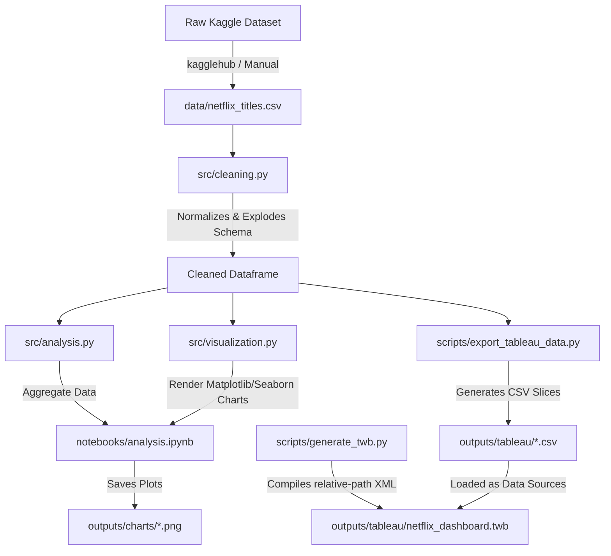

# Netflix Content Strategy Analysis

An end-to-end exploratory data analysis and reporting pipeline that analyzes Netflix's Movies and TV Shows catalog. This project uses Python to clean, analyze, and visualize the dataset, and structures the resulting insights for seamless consumption in interactive Tableau dashboards.

---

## 📖 Table of Contents
1. [Project Overview](#-project-overview)
2. [Key Analytical Themes](#-key-analytical-themes)
3. [System Architecture](#-system-architecture)
4. [File System Layout](#-file-system-layout)
5. [Getting Started & Installation](#-getting-started--installation)
6. [How to Run the Pipeline](#-how-to-run-the-pipeline)
7. [Visual and BI Handoffs](#-visual-and-bi-handoffs)

---

## 🔍 Project Overview

This project explores the Netflix titles dataset (sourced from Kaggle) containing metadata for over 8,800 movies and TV shows. The objective is to extract actionable strategic insights regarding:
*   **Content Mix**: Balancing high-turnover feature films with multi-season series.
*   **Production Localization**: Geographic concentration and the pivot to international content.
*   **Genre Lifecycles**: How content genres rise and fall in volume over time.
*   **Acquisition Pace**: Seasonal and yearly acceleration patterns of title additions.

The results are exported as static charts, markdown summaries, and multi-table CSV slices paired with a pre-configured Tableau Workbook (`.twb`) template for interactive reporting.

---

## 📊 Key Analytical Themes

1.  **Movies vs TV Shows**: Distribution and yearly trends of catalog share.
2.  **Genre Evolution**: Exploding multi-genre tags to identify major content trends (e.g., the rise of International Dramas/Comedies).
3.  **Geographic Hubs**: Concentrating on top-producing markets (USA, India, UK) and tracking localization growth.
4.  **Platform Expansion Dynamics**: Mapping monthly and yearly addition rates to trace Netflix's peak scaling cycles (particularly around 2019-2021).

---

## ⚙️ System Architecture

The project is designed as a **modular pipeline** to prevent code duplication between exploratory environments (Jupyter) and operational scripts (data export).



### Module Responsibilities:
*   **Data Cleaning ([cleaning.py](file:///c:/Users/Melwin/Work/Netflix-Content-Strategy-Analysis/src/cleaning.py))**: Handles structural sanitization, date/time type casting (with null checking), column renaming, and multi-value column explosions (like lists of countries or genres).
*   **Analytical Computations ([analysis.py](file:///c:/Users/Melwin/Work/Netflix-Content-Strategy-Analysis/src/analysis.py))**: Pre-calculates percentages, aggregates yearly/monthly growth metrics, and computes top-N rankings for geographic and category distributions.
*   **Visualization Engine ([visualization.py](file:///c:/Users/Melwin/Work/Netflix-Content-Strategy-Analysis/src/visualization.py))**: Configures custom Seaborn settings to match Netflix's aesthetic palette (Reds, deep grays, warm cream backgrounds) and generates standardized line, bar, pie, and heatmap figures.

---

## 📁 File System Layout

Below is the directory hierarchy and the description of each component:

```text
Netflix-Content-Strategy-Analysis/
├── .venv/                      # Python local virtual environment
├── data/                       # Raw input data directory
│   └── netflix_titles.csv      # Local source dataset (git-ignored)
├── notebooks/                  # Interactive environment
│   └── analysis.ipynb          # Narrative exploratory notebook
├── outputs/                    # Output generated artifacts
│   ├── charts/                 # Rendered PNG analytical figures (01_... to 04_...)
│   ├── reports/                # Executive summaries
│   │   └── analysis_summary.md # Business-oriented markdown report
│   └── tableau/                # BI dashboard workspace
│       ├── *.csv               # Clean, pivoted data slices for Tableau
│       ├── netflix_dashboard.twb # Pre-configured Tableau Desktop workbook template
│       ├── tableau_guide.md    # Explanations of workbook datasets
│       └── tableau_worksheet_script.md # Detailed sheet & layout instructions
├── scripts/                    # Automation and generation scripts
│   ├── export_tableau_data.py  # Pipeline script: downloads source and exports CSV slices
│   └── generate_twb.py         # Scaffold script: compiles the relative-path TWB XML
├── src/                        # Core reusable Python package
│   ├── __init__.py             # Package marker
│   ├── analysis.py             # Math, rankings, and trends logic
│   ├── cleaning.py             # Normalization and type-casting logic
│   └── visualization.py        # Styling, theming, and charting code
├── requirements.txt            # Project python dependencies
└── README.md                   # Project index & architecture document (this file)
```

---

## 🚀 Getting Started & Installation

### Prerequisites
*   Python 3.8 or higher installed on your system.
*   (Optional) Tableau Desktop 2020.4+ to run the interactive dashboard.

### Setup Steps
1.  **Clone the Repository**:
    ```bash
    git clone https://github.com/Yellomello10/Netflix-Content-Strategy-Analysis.git
    cd Netflix-Content-Strategy-Analysis
    ```

2.  **Set Up Virtual Environment**:
    ```bash
    python -m venv .venv
    # On Windows:
    .venv\Scripts\activate
    # On macOS/Linux:
    source .venv/bin/activate
    ```

3.  **Install Dependencies**:
    ```bash
    pip install -r requirements.txt
    ```

---

## 🏃 How to Run the Pipeline

The project supports running the analytical pipelines either through Jupyter or using automated scripts.

### Option A: The Full Automated Export (Tableau & Reports)
To download the latest data, clean it, prepare slices, and structure the Tableau workspace, run:
```bash
python scripts/export_tableau_data.py
```
*Note: If the `data/netflix_titles.csv` file is missing, the script will automatically invoke `kagglehub` to download the original dataset from Kaggle and stage it for analysis.*

If you need to regenerate the Tableau workbook template itself, run:
```bash
python scripts/generate_twb.py
```

### Option B: The Interactive Jupyter Notebook
1.  Launch Jupyter:
    ```bash
    jupyter notebook
    ```
2.  Open `notebooks/analysis.ipynb`.
3.  Execute all cells sequentially. Running the notebook updates all figures inside `outputs/charts/`.

---

## 📊 Visual and BI Handoffs

### 1. Static Charts
You can review the rendered visual analyses directly in the **[outputs/charts/](file:///c:/Users/Melwin/Work/Netflix-Content-Strategy-Analysis/outputs/charts)** directory. Key assets include:
*   [01_type_distribution_pie.png](file:///c:/Users/Melwin/Work/Netflix-Content-Strategy-Analysis/outputs/charts/01_type_distribution_pie.png) — Catalog ratio.
*   [02_genre_heatmap.png](file:///c:/Users/Melwin/Work/Netflix-Content-Strategy-Analysis/outputs/charts/02_genre_heatmap.png) — Genre density over release years.
*   [03_country_trends.png](file:///c:/Users/Melwin/Work/Netflix-Content-Strategy-Analysis/outputs/charts/03_country_trends.png) — Geographical production trend lines.
*   [04_monthly_growth.png](file:///c:/Users/Melwin/Work/Netflix-Content-Strategy-Analysis/outputs/charts/04_monthly_growth.png) — Platform expansion volume trends.

### 2. Interactive Tableau Workbook
To open the dashboard starter:
1.  Ensure you have run the export script (`export_tableau_data.py`) so the target CSVs exist in `outputs/tableau/`.
2.  Double-click **[netflix_dashboard.twb](file:///c:/Users/Melwin/Work/Netflix-Content-Strategy-Analysis/outputs/tableau/netflix_dashboard.twb)** inside the `outputs/tableau/` folder.
3.  All 9 data connections are pre-linked dynamically as distinct datasets (e.g., `Type Distribution`, `Yearly Growth`, `Top Countries`) with relative paths. You can immediately build sheets following the layout recommendations in [tableau_guide.md](file:///c:/Users/Melwin/Work/Netflix-Content-Strategy-Analysis/outputs/tableau/tableau_guide.md) and [tableau_worksheet_script.md](file:///c:/Users/Melwin/Work/Netflix-Content-Strategy-Analysis/outputs/tableau/tableau_worksheet_script.md).